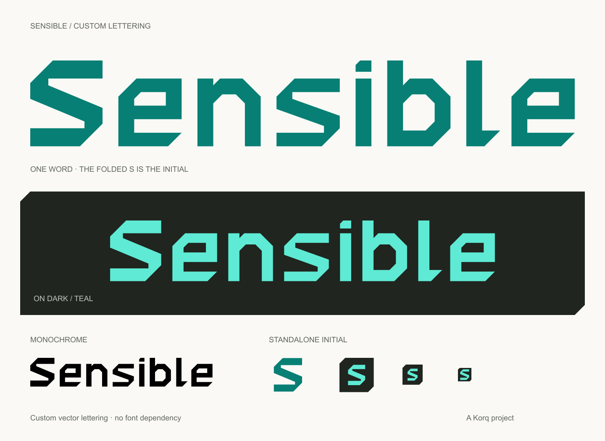
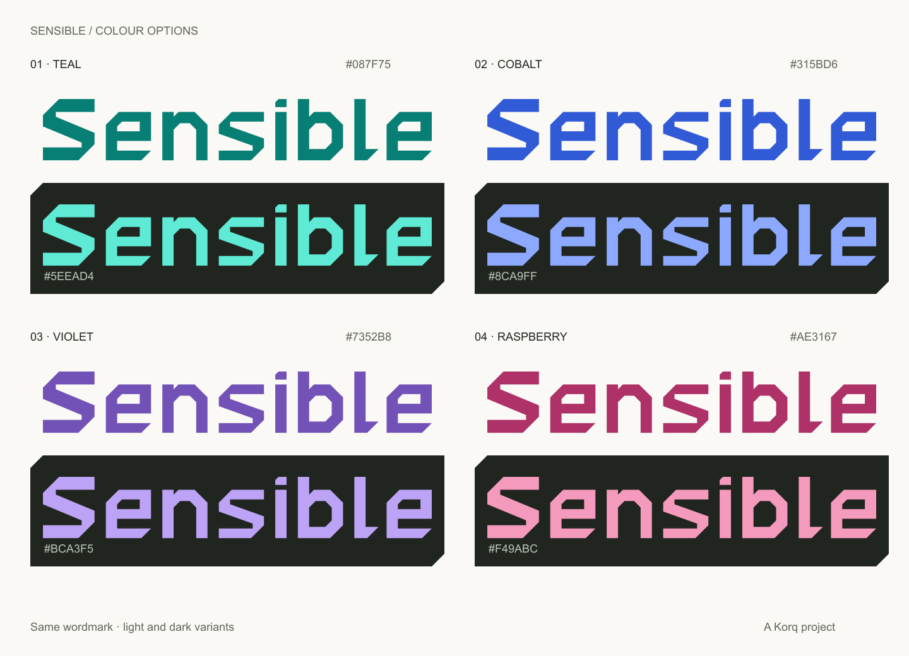

# Sensible visual identity

The logo is one custom-drawn **Sensible** wordmark. The Folded S is its first
letter, followed directly by angular lettering made for the same design.
There is no separate symbol in front of the full name.
Teal is the base colour: `#087F75` on light backgrounds and `#5EEAD4` on dark.



## Lettering

The capital S preserves the approved Folded S geometry. The lowercase s repeats
the fold, and the remaining letters use straight edges, chamfered corners and
open counters. The capital's horizontal bands are 16 units thick; the smaller
letters use 12-unit horizontal bands and 14-unit stems to keep counters open.
The title-case shape keeps the name readable as a word.

Every letter is drawn as a filled vector path. This is custom logo lettering,
not a font, and it has no external font dependency. The i dot and icon tiles
also use clipped corners. The standalone S is reserved for icons and other
placements where the full name will not fit.

## Assets

| File in `svg/` | Use |
| --- | --- |
| `sensible-logo-light.svg` | Entire wordmark in deep teal, for light backgrounds |
| `sensible-logo-dark.svg` | Entire wordmark in bright teal, for dark backgrounds |
| `sensible-logo-black.svg` | Entire wordmark in black, for monochrome print |
| `sensible-logo-white.svg` | Entire wordmark in white, for reversed artwork |
| `sensible-wordmark.svg` | Same teal wordmark as `sensible-logo-light.svg` |
| `sensible-mark-light.svg` | Standalone Folded S in deep teal |
| `sensible-mark-dark.svg` | Standalone Folded S in bright teal |
| `sensible-mark-amber.svg` | Earlier amber symbol, kept for reference |
| `sensible-mark-charcoal.svg` | Standalone Folded S in charcoal |
| `sensible-mark-black.svg` | Standalone Folded S in black |
| `sensible-mark-white.svg` | Standalone Folded S in white |
| `sensible-icon.svg` | Padded initial on a tile with clipped corners |
| `sensible-favicon.svg` | Initial with a smaller inset for tiny placements |

`png/` contains 1,600 px wide logos, 512 px teal, amber and charcoal symbols,
180/192/512 px icons, and 16/32/48 px favicons. `favicon.ico` contains all three
favicon sizes. Use SVG where supported. Logo and mark backgrounds are
transparent; icons include a charcoal tile with transparent clipped corners.

The overview SVG and PNG are presentation sheets. Their captions use Arial;
the production artwork in `svg/` contains only vector shapes.

## Colour options



Four palettes use the exact same wordmark and symbol geometry; teal is selected.
Each has a deeper shade for light backgrounds and a brighter shade for dark
backgrounds. The existing amber artwork remains available as a reference.

| Palette | On light | On dark | Folder |
| --- | --- | --- | --- |
| Teal (base) | `#087F75` | `#5EEAD4` | `palettes/teal/` |
| Cobalt | `#315BD6` | `#8CA9FF` | `palettes/cobalt/` |
| Violet | `#7352B8` | `#BCA3F5` | `palettes/violet/` |
| Raspberry | `#AE3167` | `#F49ABC` | `palettes/raspberry/` |

Each folder contains light/dark logos and symbols in SVG and PNG, a clipped
icon in SVG and 512 px PNG, an SVG favicon, 16/32/48 px favicon PNGs, and a
multi-size `favicon.ico`. Light/dark filenames describe the intended background.
The icon tile uses charcoal, with the brighter palette shade for the initial.

## Colour and placement

| Colour | Hex | Role |
| --- | --- | --- |
| Deep teal | `#087F75` | Wordmark on light backgrounds; graphic accents |
| Bright teal | `#5EEAD4` | Wordmark on dark backgrounds; icon initial |
| Charcoal | `#20251F` | Dark surfaces; neutral artwork |
| Paper | `#FAF9F5` | Light surfaces |
| Black / white | `#000000` / `#FFFFFF` | Single-colour artwork |

- Keep the full wordmark in one colour so it reads as one word.
- Preserve the SVG aspect ratio; leave at least one band thickness of space
  around the visible artwork (16 units at native scale).
- Use the wordmark at 180 px wide or larger. At smaller sizes, use the initial.
- Use the favicon at 16–48 px and the padded icon for desktop launchers.
- Keep supporting copy such as “A Korq project” outside the logo.
- Use `alt="Sensible"` on a logo image, or empty alt text when adjacent text
  already provides the same name.
- The manual can retain its readable body-text font. Custom lettering is for
  the logo; the ASCII wordmark remains the terminal version.

The wordmark's artboard is 514 × 108 units, with 16-unit padding. Its cap height
is 76 units and its lowercase body height is 60 units. The standalone symbol
uses a 96 × 96 artboard and is rotationally symmetric about its centre.

## Editing and export

`source/lettering.json` is the shared geometry and spacing source; its
`basePalette` selects teal. `source/palettes.json` defines the palette colours. Edit these
and run `source/export.cjs` to regenerate every SVG, PNG, ICO and both
presentation sheets, and the manual's local logo assets. The exporter requires Node.js and `sharp`; neither is
needed to use the artwork.

From the repository root, with sharp installed in Node's module search path:

```sh
node assets/brand/source/export.cjs
```

If sharp is provided by a separate tool runtime, set `NODE_PATH` to that
runtime's `node_modules` directory for this command. Exports use filled paths,
so changing a logo never requires a font installation.

Sensible artwork is covered by the repository's [MIT license](../../LICENSE).
This custom lettering replaces the earlier Inter-based logo. No font software
or third-party glyph outlines are included.

The main README and all three manual pages use the teal logo. The exporter
also copies the two primary SVGs and favicon into `manual/assets/`, so source
previews and the staged offline manual work without access to this folder.
`scripts/stage-manual.sh` includes those files in the installed payload.
